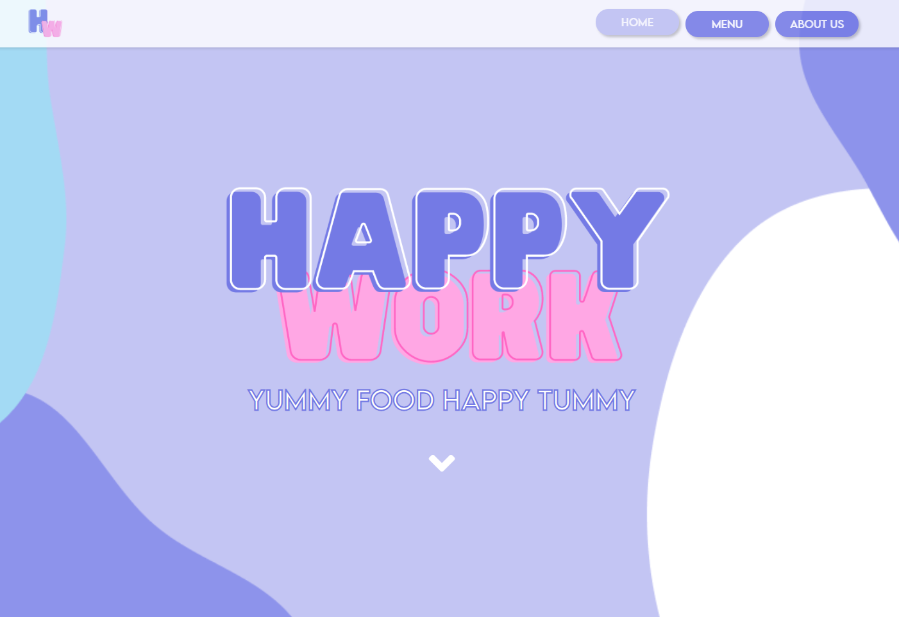

# NG STORE

Welcome to HappyWork, a web application built using HTML, CSS, and JavaScript. HappyWork is a Random Name Food Generator with CRUD (Create, Read, Update, Delete) functionality. With this application, you can generate random food dish names from a list of registered dishes or add your own dishes.

🌐 Website: [**Happy Work**](https://nehemiagueldi.github.io/HappyWork)

With HappyWork's Random Name Food Generator and CRUD functionality, you can unleash your creativity and explore a myriad of food dish names. Whether you're brainstorming ideas for your next cooking project or just having some fun, HappyWork has you covered.

## Features

- **Randomize Food Dish Names**: Click on the "Randomize" button to generate a random food dish name from the list of registered dishes. Let HappyWork inspire you with unique and creative dish names.

- **Add New Dishe**s: Use the "Add Menu" button to add new dishes to the list. Enter the dish name in the input field and click "Add Menu" to include it in the registered dishes.

- **Edit and Delete Dishes**: Easily manage your registered dishes. Click the "Edit" button to update a dish name, and click "Save" to save the changes. Use the "Delete" button to remove a dish from the list.

## Technologies Used
HappyWork has been developed using the following technologies:

- [**HTML**](https://html.com): The structure and layout of the web pages in HappyWork are created using HTML (Hypertext Markup Language), providing a semantic structure for the application.

- [**CSS**](https://www.w3schools.com/css): Cascading Style Sheets (CSS) is used to enhance the visual appearance of HappyWork. CSS styles are applied to HTML elements to create an attractive and user-friendly interface.

- [**JavaScript**](https://www.w3schools.com/js): The dynamic functionality of HappyWork is implemented using JavaScript. JavaScript provides interactivity, allows for user input, and enables CRUD operations on the list of registered dishes.
## Deployment

- **Deploy to Vercel**

- **Deploy to Netlify**

- **Clone this repository**

## ☕ Buy me a coffee

 

## 🔗 Links

   
